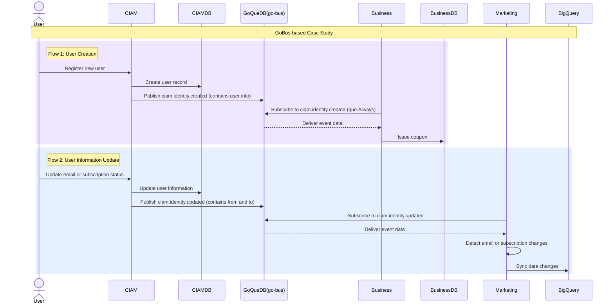

```mermaid
sequenceDiagram
    %% Participants definition
    actor User
    participant CIAM
    participant CIAMDB
    participant GoQueDB as GoQueDB(go-bus)
    participant Business
    participant BusinessDB
    participant Marketing
    participant BigQuery

    %% Title and styling
    note over User,BigQuery: GoBus-based Case Study

    %% Flow 1: User Creation
    rect rgb(240, 230, 255)
    note right of User: Flow 1: User Creation
    User->>CIAM: Register new user
    CIAM->>CIAMDB: Create user record
    CIAM->>GoQueDB: Publish ciam.identity.created (contains user info)
    Business->>GoQueDB: Subscribe to ciam.identity.created (que.Always)
    GoQueDB-->>Business: Deliver event data
    Business->>BusinessDB: Issue coupon
    end

    %% Flow 2: User Information Update
    rect rgb(230, 240, 255)
    note right of User: Flow 2: User Information Update
    User->>CIAM: Update email or subscription status
    CIAM->>CIAMDB: Update user information
    CIAM->>GoQueDB: Publish ciam.identity.updated (contains from and to)
    Marketing->>GoQueDB: Subscribe to ciam.identity.updated
    GoQueDB-->>Marketing: Deliver event data
    Marketing->>Marketing: Detect email or subscription changes
    Marketing->>BigQuery: Sync data changes
    end
```
